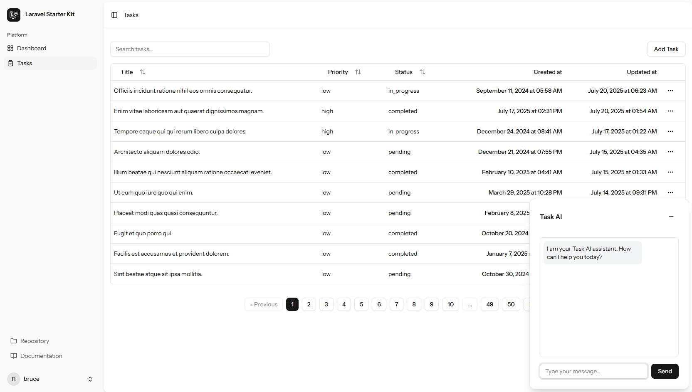

# 🧠 Task Manager AI

An intelligent task management system built with Laravel, Inertia, and React — powered by local AI via Ollama. This app helps you manage tasks and chat with an AI assistant that understands your workload.

---

## 🚀 Features

- Create, update, and manage tasks with priority and status
- Floating AI chat assistant to summarize, analyze, or track tasks
- Markdown support in the chat
- Works offline using a locally running AI model

---

## 🛠️ Stack

- **Backend**: Laravel 12
- **Frontend**: React + Inertia.js
- **AI Integration**: [Ollama](https://ollama.com) + `gemma3:1b` model
- **UI**: [shadcn/ui](https://ui.shadcn.com) + Tailwind CSS
- **Markdown rendering**: react-markdown
- **Syntax highlighting**: [Prism](https://prismphp.com/providers/ollama.html)

---

## 🧪 Running Locally

### 🔧 Requirements

- [Docker Desktop](https://www.docker.com/products/docker-desktop) (with WSL/Ubuntu integration)
- [Ollama](https://ollama.com/download)
- PHP >= 8.1 (handled via Sail)
- Node.js + npm/yarn (for frontend assets)

---

### ✅ Setup Steps

1. **Clone the repo**
   ```bash
   git clone https://github.com/your-username/task-manager-ai.git
   cd task-manager-ai
   ```

2. **Install Laravel dependencies**
   ```bash
   cp .env.example .env
   ./vendor/bin/sail up -d
   ./vendor/bin/sail composer install
   ./vendor/bin/sail artisan key:generate
   ./vendor/bin/sail artisan migrate
   ```

3. **Install JS dependencies**
   ```bash
   npm install && npm run dev
   ```

4. **Launch Laravel Sail**
   ```bash
   ./vendor/bin/sail up
   ```

---

### 🤖 AI Setup (Ollama)

1. **Install Ollama locally**  
   → https://ollama.com/download

2. **Add the Gemma model**
   ```bash
   ollama pull gemma3:1b
   ```

3. **Run the model**
   ```bash
   ollama run gemma3:1b
   ```

> ⚠️ The AI chat assistant requires the model to be running locally via Ollama.

---

## 🌟 Special Mentions

- [**PrismPHP**](https://prismphp.com/providers/ollama.html) — for advanced AI + Laravel integration.
- [**Ollama**](https://ollama.com) — seamless local LLM runtime.

---

## 📸 Screenshots

---

## 📄 License

MIT — free to use, modify, and distribute.

---

## 🙌 Author

Made with ☕ by [Bruce Phillip Perez](https://github.com/bruzp)
