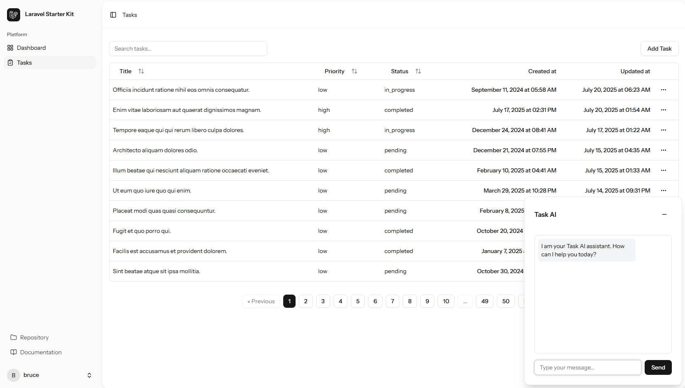

# 🧠 Task Manager AI

An intelligent task management system built with Laravel, Inertia, and React — powered by local AI via Ollama. This app helps you manage tasks and chat with an AI assistant that understands your workload.

---

## 🚀 Features

- Create, update, and manage tasks with priority and status
- Floating AI chat assistant to summarize, analyze, or track tasks
- Markdown support in the chat
- Works offline using a locally running AI model

---

## 🛠️ Stack

- **Backend**: Laravel 12
- **Frontend**: React + Inertia.js
- **AI Integration**: [Ollama](https://ollama.com) + `qwen2.5:0.5b` model  (Dockerized)
- **UI**: [shadcn/ui](https://ui.shadcn.com) + Tailwind CSS
- **Markdown rendering**: react-markdown

---

## 🧪 Running Locally

### 🔧 Requirements

- Docker Desktop (with WSL/Ubuntu integration enabled)
- Ollama installed locally
- Git

---

### ✅ First-Time Setup

1. **Clone the repository**

   ```bash
   git clone https://github.com/bruzp/task-manager-ai.git
   cd task-manager-ai
   ```

2. **Build Docker images**

   ```bash
   docker compose build --no-cache
   ```

3. **Install PHP dependencies**

   ```bash
   docker compose run --rm app composer install
   ```

4. **Create environment file**

   ```bash
   cp .env.example .env
   ```

5. **Start containers**

   ```bash
   docker compose up -d
   ```

6. **Generate application key**

   ```bash
   docker compose exec app php artisan key:generate
   ```

7. **Configure database settings** (Optional)

   Update the `.env` file with your database credentials if needed.

8. **Run migrations and seeders**

   ```bash
   docker compose exec app php artisan migrate --seed
   ```

9. **Install frontend dependencies**

   ```bash
   docker compose exec node npm install
   ```

10. **Access the application**

Open your browser and visit:

```
http://localhost:8000
```

---

### 🔄 Daily Development Workflow

Start containers:

```bash
docker compose up -d
```

Run frontend dev server (if not auto-running):

```bash
docker compose exec node npm run dev
```

Stop containers:

```bash
docker compose down
```

---

## 📸 Screenshots


---

## 📄 License

MIT — free to use, modify, and distribute.

---

## 🙌 Author

Made with ☕ by [Bruce Phillip Perez](https://github.com/bruzp)
